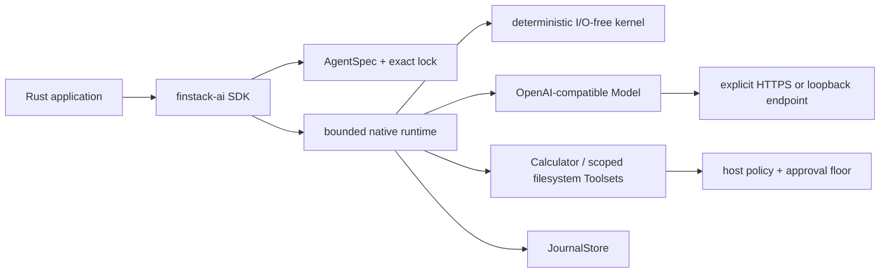

# Native architecture

The kernel owns semantic state, records, events, effects, and invariants. The
runtime owns the six primary port contracts and executes effects only after the
request records commit. The SDK owns composition and retains direct resolved
handles; the per-run path performs no registry lookup.

Side-effecting tools receive a durable approval requirement in the preview
facade. The filesystem toolset holds an already-opened explicit root, rejects
symlink/path escapes, protects sensitive names, applies fixed bounds, and fails
closed on platforms without the required safe primitives.
