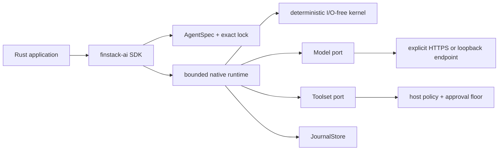

# Native architecture

The kernel owns semantic state, records, events, effects, and invariants.
The runtime owns the six primary port contracts and executes effects only
after the request records commit. The SDK owns composition and retains
direct resolved handles; the per-run path performs no registry lookup.

Side-effecting tools receive a durable approval requirement in the SDK
facade. `ApprovalRequirement::Policy` is a mandatory approval floor on
every resolved catalog — host `Allow` cannot weaken it — not only on
catalogs assembled by `Agent` constructors. `RunPolicy.approval_grant`
(`ApprovalGrantMode::PerCall` by default, or `InformedBatch`) selects
how those unpaid paid tools park; it does not change the floor. The
filesystem toolset holds an already-opened explicit root, rejects
symlink/path escapes, protects sensitive names, applies fixed bounds,
and fails closed on platforms without the required safe primitives.

Workflow, server, observer, and plugin leaves are opt-in. They are not
shown on the default path. See [concept](concept.md) and
[trust levels](security-trust-levels.md).
